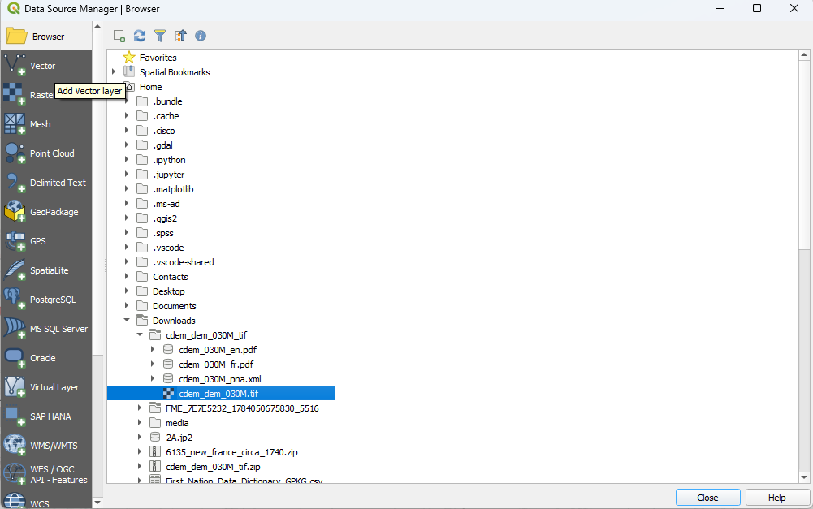
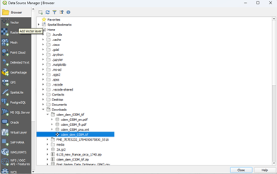
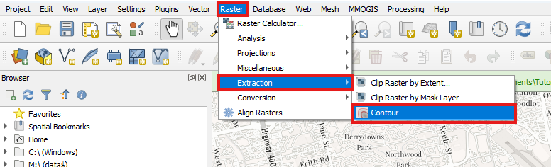
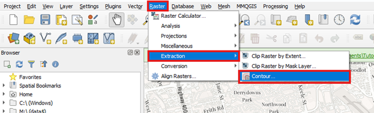
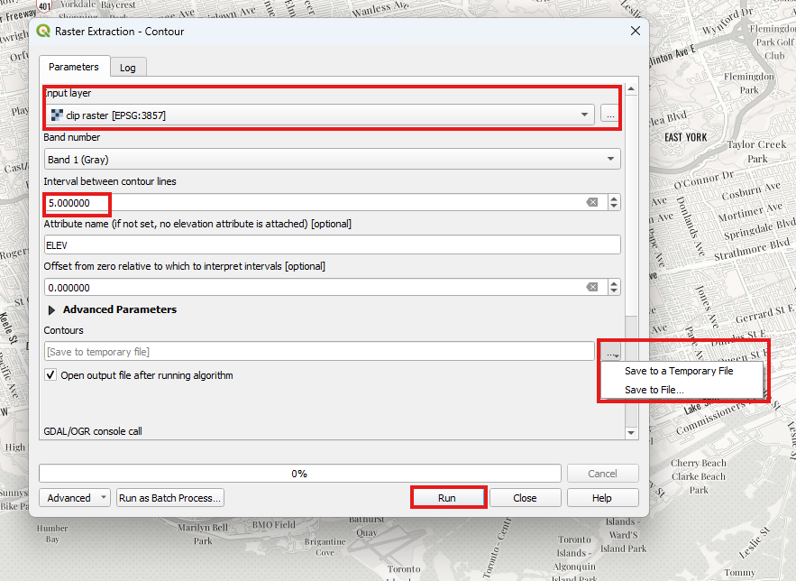

# Creating contours using QGIS

**Table of Contents**

* [Introduction](#introduction)
* [Get Your Data](#project-set-up)
* [Data Set Up](#data-set-up)
* [Create Contours](#create-contours)

## Introduction

Digital elevation models (DEMs) are geospatial datasets that contain
elevation values sampled according to a regularly spaced rectangular
grid. They can be used in terrain analysis, 3D visualizations, and
hydrological modelling, among other applications. DEMs can be stored in
several different formats; however, DEMs can be stored in various
formats. This tutorial explains how to derive contours from DEMs using
QGIS.

You may also find these related guides helpful as you work with DEM
files:

Selecting the right projection:
<https://mdlutoronto.github.io/selecting-right-projection/>

Projecting your data:
<https://mdlutoronto.github.io/projecting-data-qgis/>

## Get your data

To download a DEM file from GeoGratis as was done in this tutorial,
follow the instructions in here: 
<https://mdlutoronto.github.io/geogratis-downloading-data/n> but
select the Elevation tab instead of Raster and download the Zip file.
Open the Zip file by right clicking that file and selecting "Extract
All\..." and choosing a locating for the data. Now you should have a
large TIFF file in the folder that has the DEM for your chosen area.

## Data Set Up

- Open QGIS, and if you do not have a project open, open a new project
  and select a basemap to your preference from Web -\> QuickMapServices.
  Here we selected Newspaper.

- Add the DEM by selecting Layer -\> Add Layer -\> Add Raster Layer from
  the Main Menu. Click on browse and navigate to where you saved the
  DEM.

- If you want to use a specific area of the DEM, you can clip the raster
  using this tutorial:
  <https://mdlutoronto.github.io/qgis-clipping-rasters/> . Here we
  clipped to the GTA extent.

## Create Contours

- From the Main Menu, Select Raster -\> Extraction -\> Contour\...

- In the Raster extraction Pop-up window, select the DEM layer from
  "Input layer" drop-down menu. The Interval between Contour Lines is in
  metres (but can be changed to feet). Feel free to experiment with the
  number until you reach a contour that works for you, but remember, the
  larger the number, the fewer lines there will be. By default, the
  layer will be temporary unless you save it to a file. Click Run.

- After completion, you can style the contour lines by right clicking on
  the layer and clicking on Properties. Choose Symbology and make your
  desired changes.

- The generated contours and changes will be reflected in the map.

